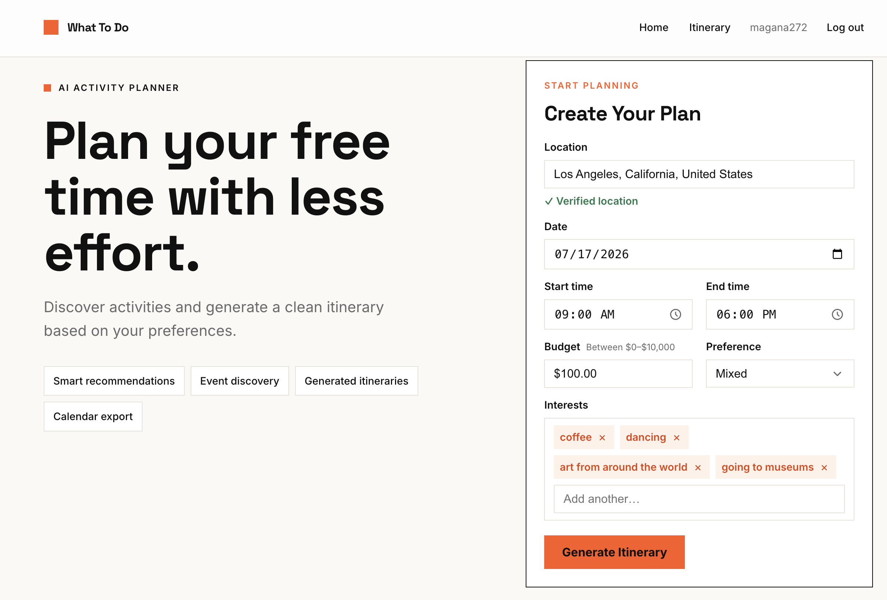
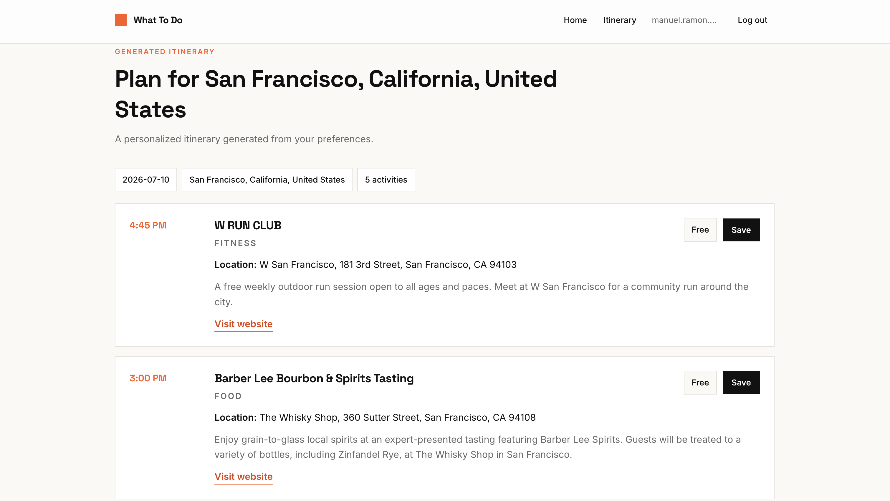
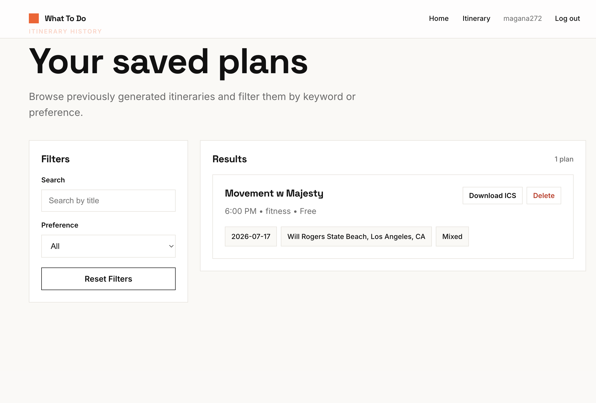

# What To Do

## Project Overview

**What To Do** is an AI-powered activity planning system that helps users quickly decide how to spend their free time. Instead of manually searching across multiple platforms such as event websites, maps, social media, and calendars, the system generates personalized activity recommendations and structured schedules based on user preferences.

The goal is to reduce decision fatigue and make planning faster by combining AI-powered intent detection, event discovery, and calendar integration.

- **Live app:** https://magana272.github.io/WhatToDo/

---

## Screenshots

### Home – Create Your Plan
Users enter their location, date, time window, budget, preference (indoor/outdoor/mixed), and interests to generate an itinerary.



### Generated Itinerary
The system returns a personalized, time-ordered list of real activities with locations, descriptions, and links. Individual activities can be saved.



### Saved Plans
Previously generated itineraries can be browsed, filtered by keyword or preference, downloaded as ICS calendar files, or deleted.



---

## Problem Statement

Many users struggle to decide how to spend their free time even when they know their interests. Existing tools require users to manually search across multiple platforms, compare options, and organize plans themselves.

This often leads to:

- Decision fatigue  
- Time wasted searching across different platforms  
- Difficulty converting ideas into actionable schedules  

---

## Objective

The goal of **What To Do** is to create an AI-powered planning assistant that generates activity suggestions, itineraries, and calendar schedules based on user interests, location, and time availability.

The application reduces manual planning effort through:

- AI-based intent recognition  
- Real-world event discovery  
- Calendar integration  

---

## Example Use Case

### Generate a Weekend Itinerary

**Actor:** User

**Scenario:**  
A user wants to plan activities for the weekend.

### Steps

1. The user fills in UI fields such as location, time range, and indoor/outdoor preference.
2. The system retrieves relevant events and activities using event APIs and map services.
3. The system generates a suggested itinerary.
4. The user downloads the plan as an ICS file or saves it.

### Outcome

The user receives a complete activity plan without needing to manually search for events.

---

## Project Scope

The system includes the following components:

- User input through the UI  
- AI intent detection and response generation  
- Activity and event retrieval from external sources  
- Data normalization into a consistent activity format  
- Itinerary generation  
- Calendar schedule export as an ICS file  

---

## Repository Structure

```
.
├── backend/                # FastAPI backend (routers, services, models, tests)
├── what-to-do-frontend/    # Next.js frontend
├── img/                    # Application screenshots used in this README
└── README.md
```

See `backend/README.md` and `what-to-do-frontend/README.md` for setup and run instructions for each component.

---

## Technology Stack

### Frontend
- Next.js (React 19, TypeScript)
- Tailwind CSS v4
- Deployed as a static export on GitHub Pages

### Backend
- Python with FastAPI
- SQLAlchemy ORM (SQLite by default, PostgreSQL supported)
- JWT-based authentication
- Optional SMTP email for password resets
- Docker, deployed on Render
- pytest for testing

### AI Engine
- OpenAI and Anthropic APIs for intent detection, activity discovery, and itinerary generation

---

## External Interfaces

The application integrates with external services including:

- OpenAI API (or equivalent LLM) for AI-powered recommendations  
- Event or location APIs for activity discovery  

---

## Functional Requirements

1. The system shall allow users to provide preferences through the UI (time, location, indoor/outdoor, etc.).
2. The system shall classify user intent as interest-based or time-based.
3. The system shall retrieve activities and events using AI-powered queries.
4. The system shall normalize activity data into a unified format (title, location, time, description).
5. The system shall rank and filter results based on relevance, distance, and user constraints.
6. The system shall generate a structured itinerary.
7. The system shall generate an ICS calendar file from the itinerary.
8. The system shall display recommendations clearly in the UI.

---

## Non-Functional Requirements

### Performance
Results should be generated within **45 seconds**, depending on external API response times.

### Reliability
The system should handle failed API calls gracefully and return partial results when possible.

### Usability
The interface should be simple and require minimal steps for users to generate a plan.

### Security & Privacy
User inputs such as location and preferences should be protected and not stored unless required.

---

# Deployment Details
The backend API is hosted on Render and accessible at `https://whattodo-uc1a.onrender.com`. The frontend is a static Next.js export deployed to GitHub Pages at `https://magana272.github.io/WhatToDo/`.

The workflow for deployment includes:
1. **Development**: Code is developed locally and pushed to GitHub.
2. **CI**: GitHub Actions run backend lint and tests on every push and pull request to `main`.
3. **Frontend Deployment**: A GitHub Actions workflow builds the Next.js static export and publishes it to GitHub Pages on every push to `main`.
4. **Backend Deployment**: Render builds and deploys the backend from `backend/Dockerfile`.
5. **Testing**: After deployment, the application is tested to ensure all functionalities work as expected.

---

## Authors

Originally developed as a team project by:

- Manuel Magana
- Shiqiu Chen
- Songting Yang
- Qian Li

Currently maintained by Manuel Magana.
